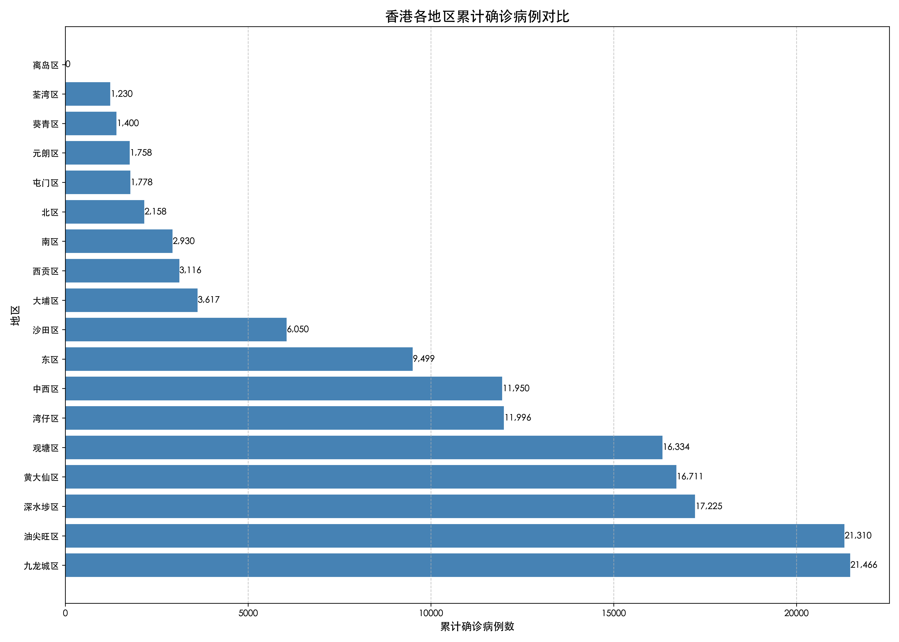
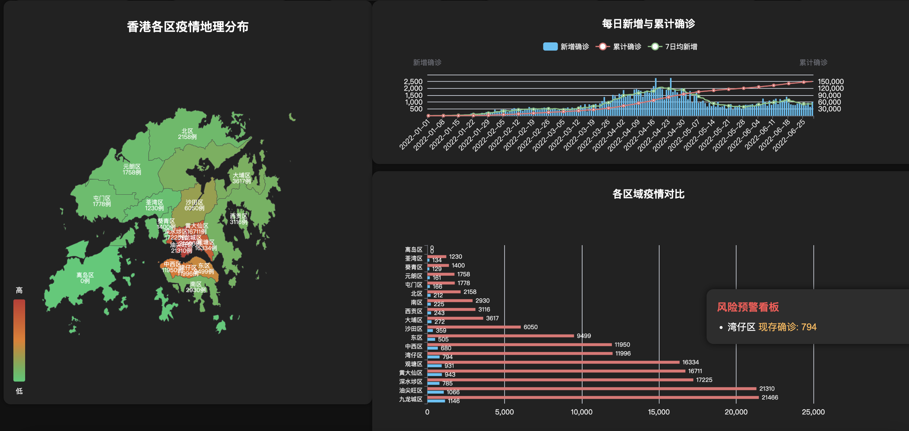

# Hong Kong COVID-19 Real-Time DashboardAdd commentMore actions

This project is a real-time COVID-19 monitoring dashboard for Hong Kong, built with Flask, Pandas, and ECharts. It visualizes epidemic data by region, providing rich, auto-refreshing, and well-organized insights for teaching, analysis, and demonstration purposes.

## Features

- **Top Cards**: Key indicators such as total confirmed, current confirmed, recovered, deaths, incidence rate, and total population.
- **Geographical Distribution Map**: Dynamic map of Hong Kong districts showing case numbers and risk levels.
- **Daily New & Cumulative Trends**: Line and bar charts for daily new cases, cumulative confirmed, and 7-day averages.
- **Regional Comparison**: Horizontal bar chart comparing confirmed and current cases by district.
- **Trend Analysis**: Multi-dimensional trends for current confirmed, recovered, and deaths.
- **Risk Warning**: List of high-risk districts for real-time monitoring.

## Project Structure

```
CASE-dashboard_epidemic/
├── bigscreen_app.py              # Main Flask backend providing data APIs
├── plot_epidemic_curves.py       # Script for generating static epidemic trend images
├── 香港各区疫情数据_20250322.xlsx # Core data source (Excel)
├── 各地区确诊病例对比图.png       # Example static visualization
├── 每日确诊数据统计图.png         # Example static visualization
├── 活跃病例数据统计图.png         # Example static visualization
└── templates/
    ├── dashboard.html            # Main dashboard frontend (ECharts)
    └── bigscreen.html            # Legacy dashboard page
```

## Requirements

- Python 3.7+
- Flask
- pandas
- openpyxl
- matplotlib (for plot_epidemic_curves.py only)

Install dependencies (recommended in a virtual environment):

```bash
pip install flask pandas openpyxl matplotlib
```

## How to Run
   ```bash
   python plot_epidemic_curves.py
   ```
The images will be saved in the current path




1. **Start the backend service**

   ```bash
   python bigscreen_app.py
   ```
   Default port is `5002`. Open your browser and visit [http://localhost:5002](http://localhost:5002).

2. **View the dashboard**

   Open your browser and go to `http://localhost:5002` to see the real-time dashboard.

3. **Generate static epidemic trend images (optional)**

   ```bash
   python plot_epidemic_curves.py
   ```
   The generated images will be saved in the current directory.

## Main API Endpoints

| Path               | Method | Description                        |
|--------------------|--------|------------------------------------|
| `/`                | GET    | Dashboard main page                |
| `/api/summary`     | GET    | Top card summary data              |
| `/api/map`         | GET    | Data for the geographical map      |
| `/api/daily`       | GET    | Daily new & cumulative trends      |
| `/api/region_bar`  | GET    | Regional comparison bar chart data |
| `/api/trend`       | GET    | Trend analysis data                |
| `/api/risk_board`  | GET    | High-risk districts for warnings   |

All endpoints return JSON. The frontend fetches and renders data via AJAX.

## Data Description

- Data file: `香港各区疫情数据_20250322.xlsx`
- Example fields: Date, District Name, Total Confirmed, Current Confirmed, Recovered, Deaths, Risk Level, Population, Incidence Rate, etc.

## Visualization

- Frontend uses ECharts for maps, line, bar, and pie charts.
- Auto-refresh for real-time data updates.
- Map supports Chinese-English district name mapping for user-friendly display.

## FAQ

- **Port already in use**: Change the `port` parameter in `bigscreen_app.py`.
- **Data file not found**: Ensure `香港各区疫情数据_20250322.xlsx` is in the same directory as `bigscreen_app.py`.
- **Chinese text garbled**: For matplotlib, install a Chinese font or adjust the font settings in `plot_epidemic_curves.py`.

## References

- [ECharts Documentation](https://echarts.apache.org/en/index.html)
- [Flask Documentation](https://flask.palletsprojects.com/)

---

Feel free to modify and extend for your own needs! 
